SKYNET 3D V2.3.1
(Marlin RC8)

<https://www.facebook.com/skynet3ddevelopment>

<https://www.facebook.com/groups/OFFICIALAnet3DprinterSupportGroup/>

<skynet3ddevelopment@gmail.com> – (FACEBOOK IS THE BEST WAY TO CONTACT
ME)

<http://www.ebay.co.uk/usr/skynet3dmods>

\*\*\* credits \*\*\*

Marc Hannappel – lcd12864 support- adckeypad- anet\_10 pins

Hans Raaf- everything rc8

You guys have made my vision real . so many thanks

Changes 2.3.1 – fixed boot problem caused by sd card!

-   Fixed problems with the configuration profiles not compiling

\*\*disclaimer\*\* I (scou) am totally not responsible if ‘’you’’ kill
your printer when you modify it from its stock form.. you do so at your
own risk.. if you hurt yourself or kill your neighbours cat.. that’s on
you too ;) otherwise .. have fun !

This guide will deal with the firmware aspect of the install process. If
you need help with wiring your sensor please see the wiring diagrams
within the skynet download. If you need anymore help – head over to the
facebook group (2^nd^ link at the top of this page). This guide also
assumes that you have already had your printer set up with the default
anet firmware prior to installation. It also assumes that you have
already done some printing on your machine prior to install. This rules
out any mechanical problems when people contact me with questions

Were going to assume that you have already downloaded the firmware
package. So drag this to your desktop to make the process easier and
unzip the entire contents into their respective folders.

-   First unzip all files within the download

-   Open the Skynet3dV2.3.1 firmware folder and then open the
    configurations
    folder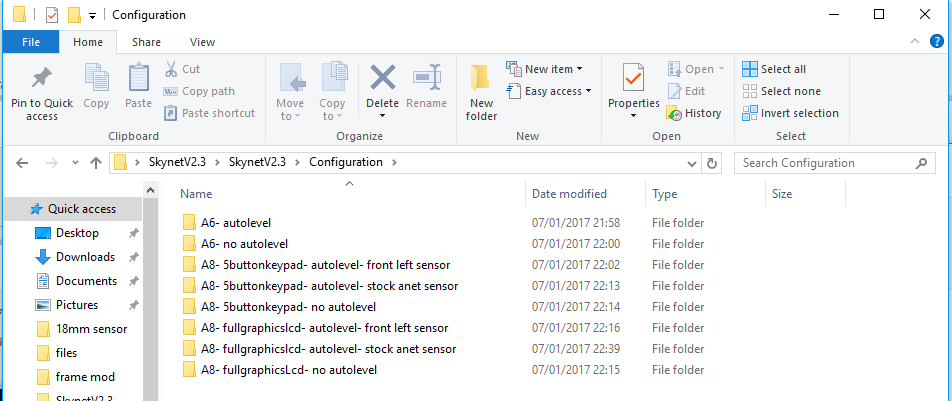

-   Open the respective folder which corresponds to your printer setup.
    Eg mine is (A8- fullgraphicslcd-autolevel- front left sensor)

-   In here you will also find the printable sensor mount for which
    corresponds to the configuration selected

-   “Right click” and “copy” the configuration.h
    file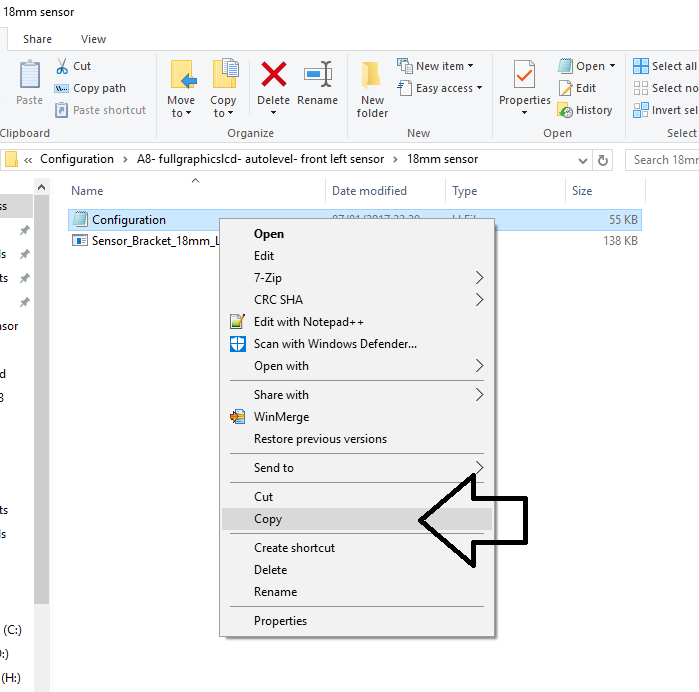

-   “paste” the configuration.h file into the “SkynetV2.3” firmware
    folder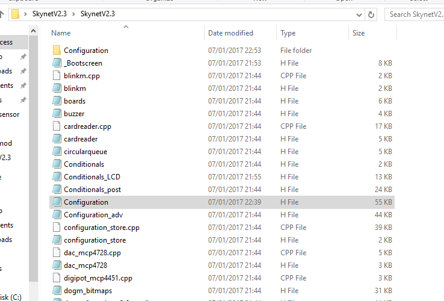

-   Now close this folder and exit out of the firmware folder.

-   Open ‘’arduino-1.8.0’’ folder and then open
    “arduino.exe”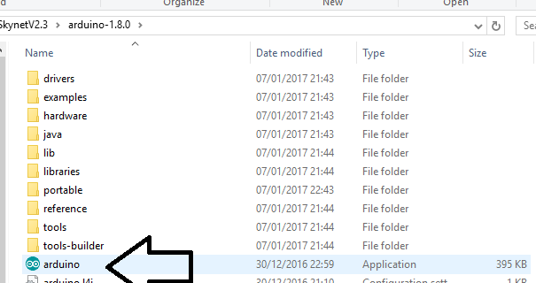

-   Go to “File” “Open”
    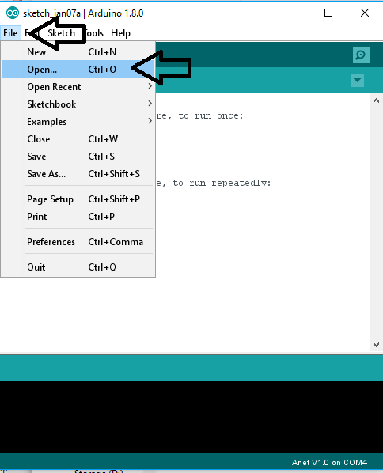

-   Browse to the firmware folder and open
    “SkynetV2.3.ino’’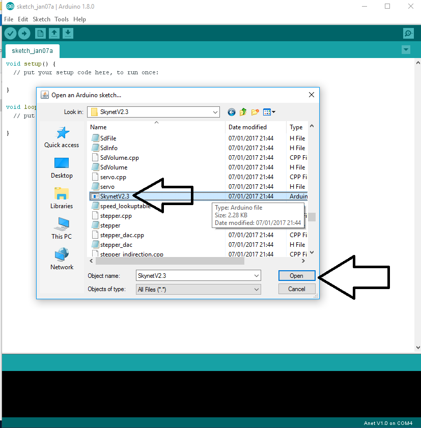

<!-- -->

-   Go to “Tools” “Board” and select “Anet V1.0”
    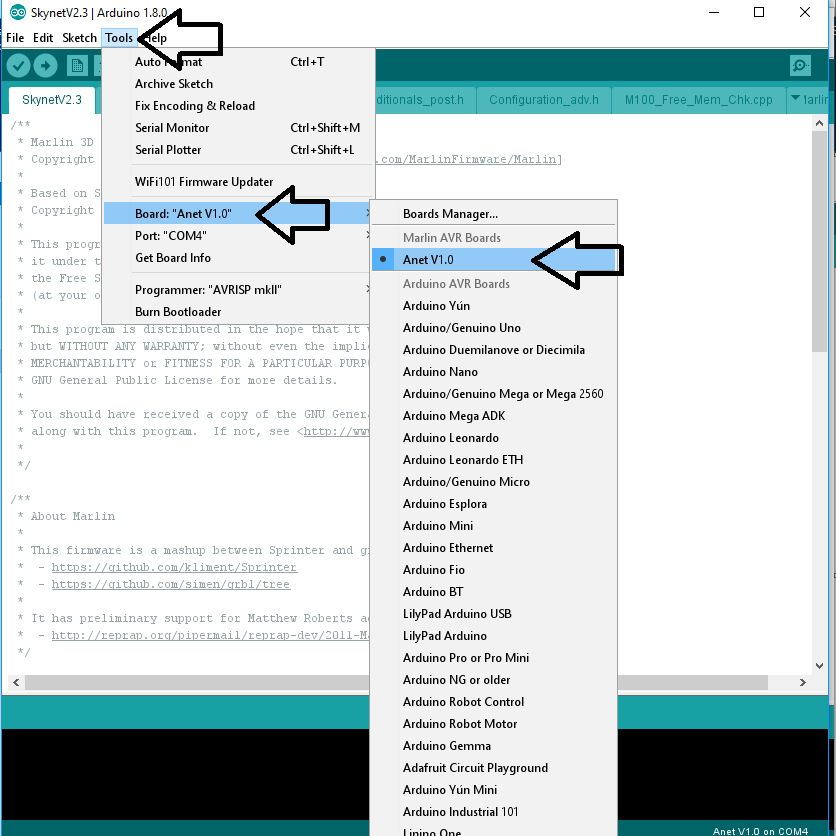

-   Go to “Tools” “Port” and Select the relavent com port for your
    printer, mine is com4

-   go to “Tools” “Programmer” and select “AVRISP mkII”

    you can check your com port if you go to “device manager” and under
    “Ports (COM &LPT) you should have “ USB-SERIAL CH340” as shown below
    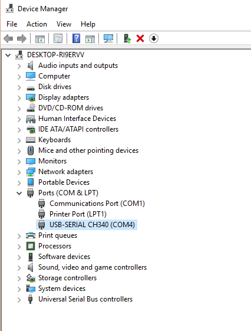

Click the “upload” Button in arduino and wait for Skynet to compile and
upload to your printer

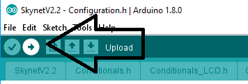

And that’s it!! Once Arduino says “done uploading” and you have the
Marlin logo on your printers screen youre done! Well youre done
installing you need to carry on to set your z-offset.

Now we configure youre z offset – this is the distance the printer has
to travel below zero in order to print because with induction sensors
you will home to z and your nozzle will be no where near the bed

-   In the Skynetv2.3.1 download folder- unzip and install Cura 15.04.6-
    once installation is complete open it.

-   Go to “file” “preferences”

-   make sure the “printing window type” is set to “Pronterface UI”
    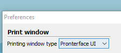

-   Go to “Machine” “Machine settings” and copy the setting exatly as
    below apart from “serial port” which you would set to the same as
    the previous steps (mine
    Com4)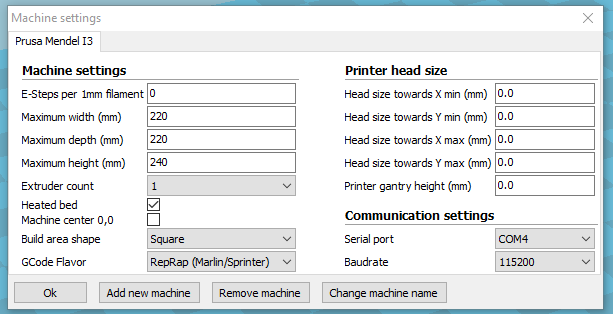

-   Now Click on the “load” button and load the “20mm cube.stl”
    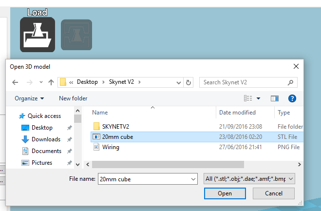

Now you want to set your settings for your chosen material on the left
side of cura (printing temps / speed/ infil etc…)

-   Click the “Print” button next to “load” and youll get the
    “Pronterface UI”
    window

If you don’t have “operational” in this window then you may have set the
wrong baudrate or com port in the “machine settings” – just go double
check they are right.

***From the pronterface window you can now start controlling your
printer via usb! ***

First use the buttons in the pronterface window to set the sensor
position

Une the buttons in pronterface to move the nozzle till it touches the
bed (DO NOT USE THE HOME BUTTON YET)

ONCE THE NOZZLE TOUCHES THE BED- SET THE SENSOR 1MM ABOVE THE BED

THEN RAISE THE NOZZLE OFF THE BED FOR THE NEXT STEP

-   In the command window type M119 and hit “enter” on your keyboard to
    check if your Zprobe is “Triggered” when it should be. Trigger by
    sensing the build surface or you can use a metal object. below you
    can see I ran that comand twice – first without a metal object below
    the sensor and secondly with a metal object below the sensor

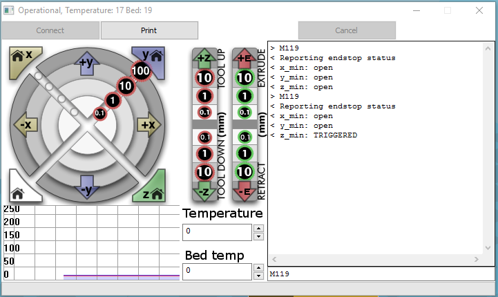

-   Now hit the white “home” button to home all
    axis.

You will notice that the printer will home X and Y and then move the
sensor to the center of the bed and lower itself until it is triggered
then it will raise to z10

-   Use the buttons in pronterface to bring the nozzle down to Z0

-   Place a sheet of a4 copy paper between the bed and the nozzle and
    lower the z axis in 0.1 incraments using the button until there is
    just a little bit of friction when moving the paper around.

-   Now run an M114 command in Pronterface
    UI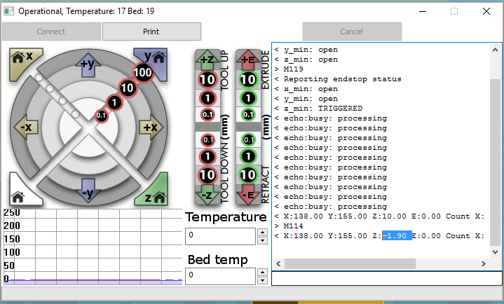

> You have now found your offset value – as you can see mine is z: -1.90

-   On your printer input pannel press the center button (Select/menu
    button)

-   Go down to “control” -select “motion” -select “Z offset : 0.00”
    -select and then in the z offset menu press the down button or
    rotate knob until it reads the desired offset value (mine is -1.90)
    and press select.

-   Then go to “menu” “control” “store memory”

Congratulations – you have now set your z offset value and you are now
ready to print!

-   Go to the “Start/End-Gcode” tab in cura and copy this gcode (the G29
    is the autolevel)

    ;Sliced at: {day} {date} {time}

    ;Basic settings: Layer height: {layer\_height} Walls:
    {wall\_thickness} Fill: {fill\_density}

    ;Print time: {print\_time}

    ;Filament used: {filament\_amount}m {filament\_weight}g

    ;Filament cost: {filament\_cost}

    ;M190 S{print\_bed\_temperature} ;Uncomment to add your own bed
    temperature line

    ;M109 S{print\_temperature} ;Uncomment to add your own temperature
    line

    G21 ;metric values

    G90 ;absolute positioning

    M82 ;set extruder to absolute mode

    M107 ;start with the fan off

    G28 X0 Y0 ;move X/Y to min endstops

    G28

    G29

    G1 Z15.0 F{travel\_speed} ;move the platform down 15mm

    G0 X2 Y2 Z2

    G92 E0 ;zero the extruded length

    G1 F200 E25 ;extrude 3mm of feed stock

    G92 E0 ;zero the extruded length again

    G1 F{travel\_speed}

    ;Put printing message on LCD screen

    M117 Printing...

-   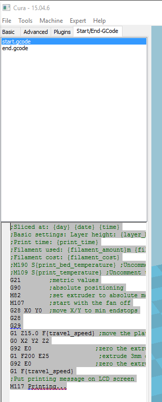

Go back to pronterface and hit “print” – allow your hotend and heatbed
to get to temperature and watch in awe as you never have to touch those
god forsaken bed screws ever again!!

If you are still not getting the desired first layer go back to the z
offset menu in the printer and adjust accordingly until you achieve the
desired “squish” – just remember to go back and “store memory” so that
your printer remembers your new offset

I hope all that was easy enough to follow.

Thanks to all of you who use and support skynet. If you feel the need to
buy me a beer, there is a donate button on the side of my facebook page
where you can donate. Every little helps and also if giving away money
isnt for you then you may opt for choosing one of my frame modifications
– sensor or other goodies at my ebay shop
http://www.ebay.co.uk/usr/skynet3dmods. All donations and mod sales all
help go towards funding this project and spreading and growing skynet
into something beautiful..

Happy printing

Pete @SkyNet3D
